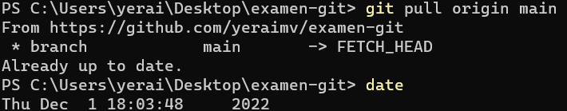
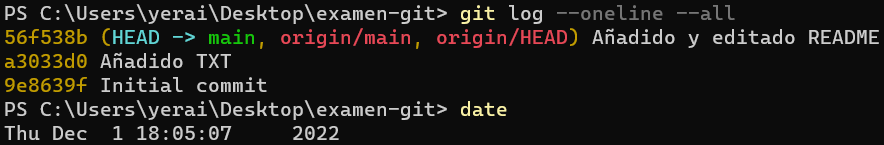
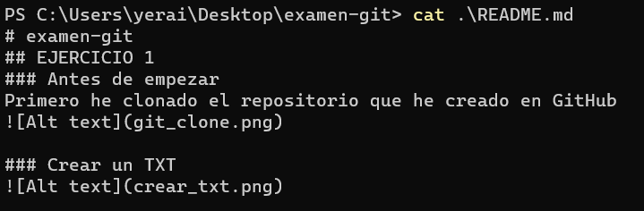
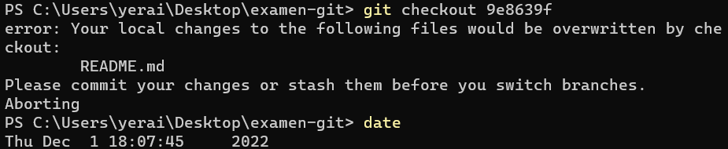
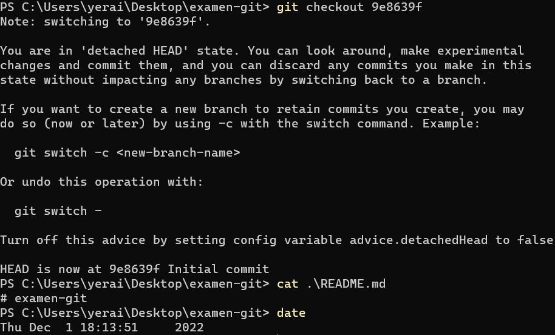
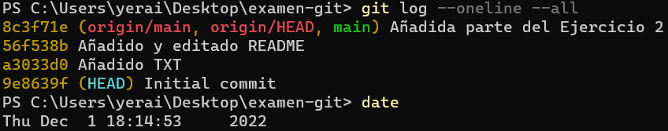
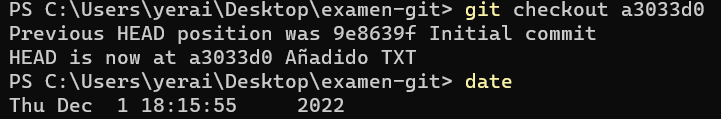
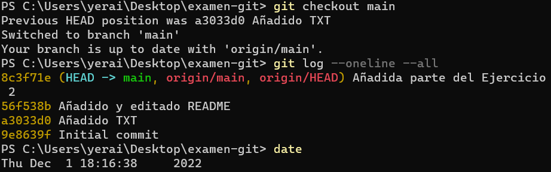

# examen-git
## EJERCICIO 1
### Antes de empezar
Primero he clonado el repositorio que he creado en GitHub

### Crear un TXT

### Añadir TXT al staged area

### Registrar los cambios

### Confirmar cambios y guardar en repositorio

### Traer los cambios realizados en main

### Volver al estado original cuando aún no se ha hecho add

### Si ya se ha hecho el add y quiero volver a una versión anterior

### Volver a una versión concreta
Para volver a una versión concreta copiaré el hash que me da GitHub

## EJERCICIO 2
### Pull del repositorio de la práctica 1
He hecho un pull del repositorio de la práctica 1 en el directorio correspondiente, para trabajar sobre el mismo.

### Comprobar que haya varios commits

### Ver el contenido del README

### Volver al primer commit

### Comprobar el estado de README en el primer commit

Antes de esto hice un add, un commit y un push ya que sino no me permitía hacer el checkout porque se cargaría el README actual que estaba editando.

### Comprobar que estoy en la rama Initial commit

### Me muevo al segundo commit

### Vuelvo al main y compruebo que esté todo en orden

