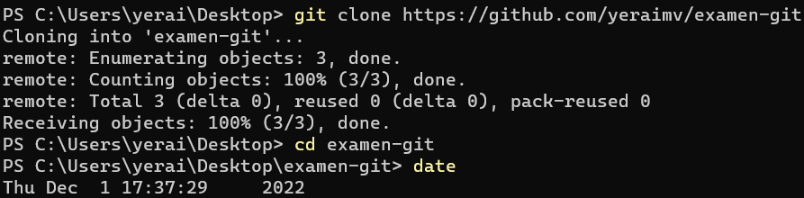
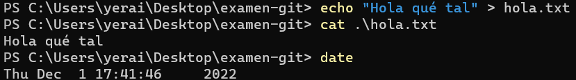
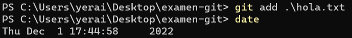
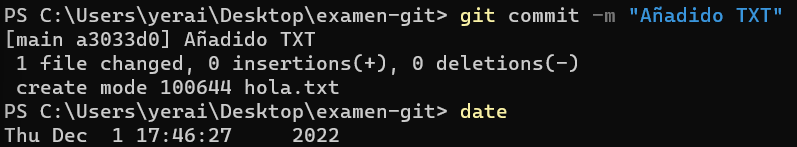
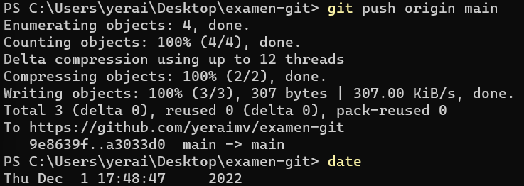
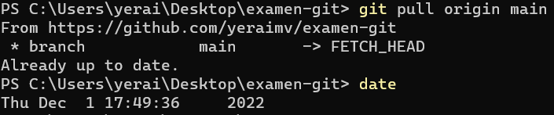
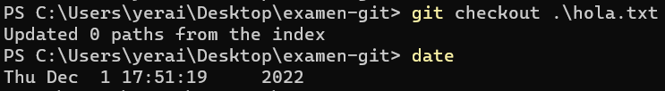
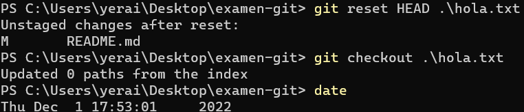
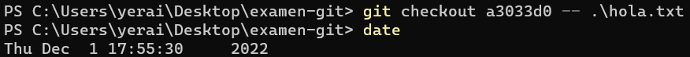

# examen-git
## Antes de empezar
Primero he clonado el repositorio que he creado en GitHub

## Crear un TXT

## Añadir TXT al staged area

## Registrar los cambios

## Confirmar cambios y guardar en repositorio

## Traer los cambios realizados en main

## Volver al estado original cuando aún no se ha hecho add

## Si ya se ha hecho el add y quiero volver a una versión anterior

## Volver a una versión concreta
Para volver a una versión concreta copiaré el hash que me da GitHub
